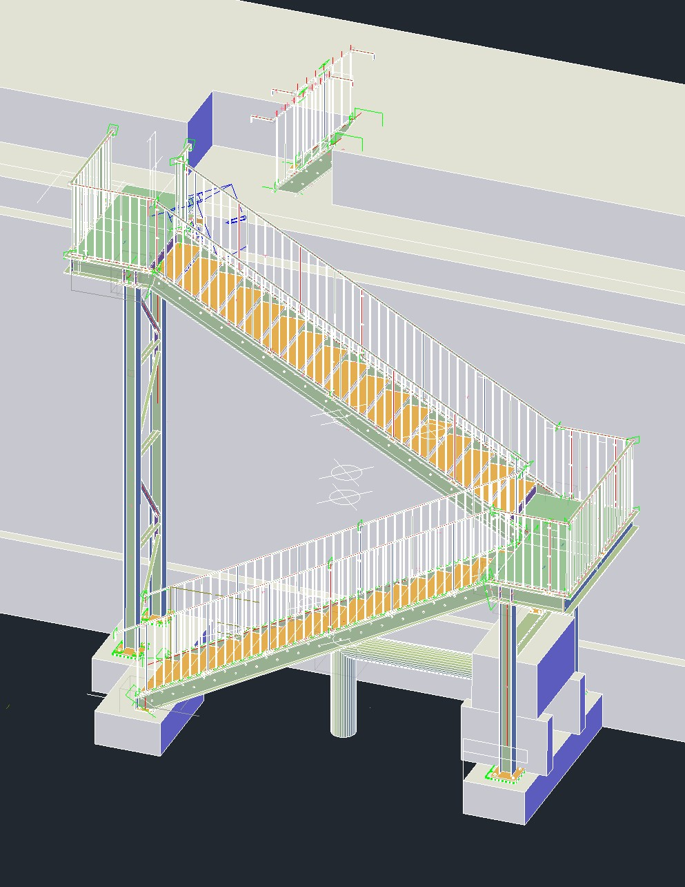

# Project: Parametric Vise Jaw Design

### Overview
This project demonstrates the design and analysis of custom, **parametric vise jaws** for a machinist's vice. The primary goal was to create a set of jaws that could be easily adapted to securely hold various irregular workpieces, minimizing setup time and improving machining accuracy. The design focuses on robust clamping mechanisms and user-friendly adjustability.

### Problem Statement
Traditional vise jaws are typically flat and parallel, which can make clamping non-rectangular or delicate parts challenging. This often leads to improvised soft jaws or complex fixturing, increasing setup time and potential for workpiece damage or slippage during machining operations.

### Solution & Key Features
My solution involves a modular vise jaw system with interchangeable inserts and adjustable clamping points.
* **Parametric Design:** Utilizes **SolidWorks** (or Fusion 360/Inventor) for fully parametric models, allowing for quick adjustments to jaw width, insert profiles, and clamping angles based on workpiece geometry.
* **Interchangeable Inserts:** Designed with quick-change mechanisms for various profiles (e.g., V-jaws for round stock, stepped jaws for shoulders, soft jaws for delicate parts).
* **Integrated Stop:** A retractable end-stop for consistent part positioning.
* **Material Selection:** Jaws designed for **6061-T6 Aluminum** for good machinability and adequate strength, with hardened steel pins for wear resistance at contact points.
* **DFM Considerations:** Design optimized for **CNC milling**, including considerations for tool access, minimal setups, and standard tooling.

### Design Process & Methodology

#### 1. Concept & Sketching
Initial concepts focused on different methods of adjustability and interchangeability. Several hand sketches were created to explore various mechanisms before moving into CAD.

#### 2. CAD Modeling (SolidWorks)
The entire assembly was modeled parametrically in SolidWorks. This involved:
* Creating a master sketch to control overall jaw dimensions.
* Utilizing design tables for quick configuration of different jaw widths and insert types.
* Assembling individual components (base jaws, inserts, pins, set screws) and defining mates to simulate movement.

**Image: Initial CAD Assembly View**

*A full assembly view of the parametric vise jaws in SolidWorks.*

#### 3. Finite Element Analysis (FEA) - SolidWorks Simulation
To ensure the jaws could withstand clamping forces without excessive deformation or failure, an FEA was performed on the most critical components.
* **Loads & Boundary Conditions:** A clamping force of 10 kN was applied to the clamping faces, simulating typical machining forces. The jaw base was fixed to represent its attachment to the vise.
* **Material Properties:** 6061-T6 Aluminum properties were defined.
* **Meshing:** A fine mesh was used in critical stress concentration areas.

**Image: FEA Stress Plot**

*Von Mises stress plot showing stress distribution under a 10kN clamping force. Max stress observed was 120 MPa, well within the yield strength of 6061-T6 Aluminum (276 MPa).*

**Image: FEA Displacement Plot**

*Displacement plot indicating maximum deformation of 0.05 mm at the clamping face, ensuring minimal workpiece deflection.*

#### 4. Manufacturing Considerations
The design was reviewed for **Design for Manufacturability (DFM)**. Features like standard hole sizes, avoidance of deep pockets requiring specialized tooling, and accessible surfaces for machining were prioritized. CNC toolpaths were considered during the design phase.

**Image: Engineering Drawing Example (PDF Link)**

*Link to a detailed engineering drawing (PDF) showing critical dimensions and tolerances for manufacturing.*

### Challenges & Solutions
* **Challenge:** Ensuring sufficient rigidity of the interchangeable inserts to prevent flex under clamping pressure.
    * **Solution:** Incorporated a dovetail mating feature for increased contact area and designed the inserts with a thicker base for improved stiffness. FEA confirmed the improved rigidity.
* **Challenge:** Creating a parametric model that was robust and wouldn't break with changing dimensions.
    * **Solution:** Used carefully planned feature ordering, relations, and design tables. Regularly tested the model with extreme dimension changes during the design phase.

### Future Work
* Development of a wider range of specialized inserts for specific part geometries (e.g., turbine blades, airfoils).
* Integration of a quick-release mechanism for even faster insert changes.
* Physical prototyping and testing to validate FEA results and evaluate real-world performance.

### Files & Resources
* `CAD/` - Contains native SolidWorks files (.SLDPRT, .SLDASM) and neutral STEP files (.stp).
* `Analysis/` - Contains SolidWorks Simulation study files and exported FEA result images/reports.
* `Drawings/` - PDF exports of detailed engineering drawings.
* `Renders/` - Additional high-quality renderings of the assembly.
